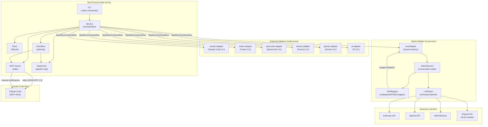
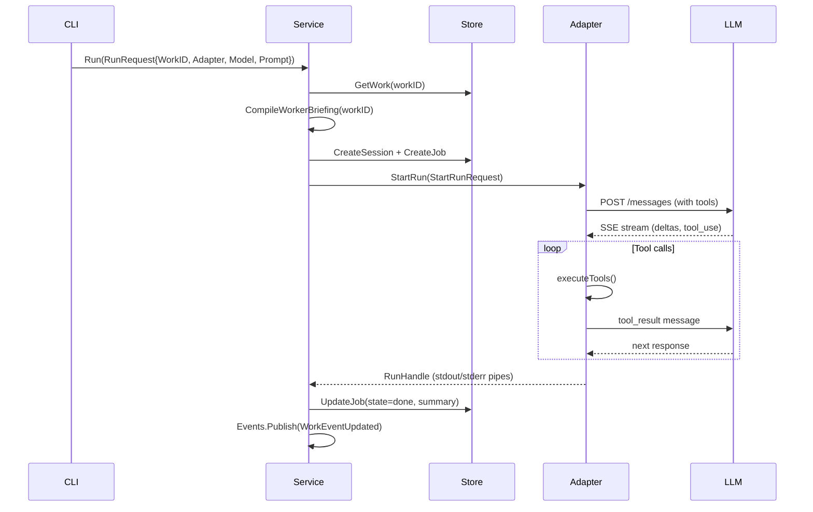
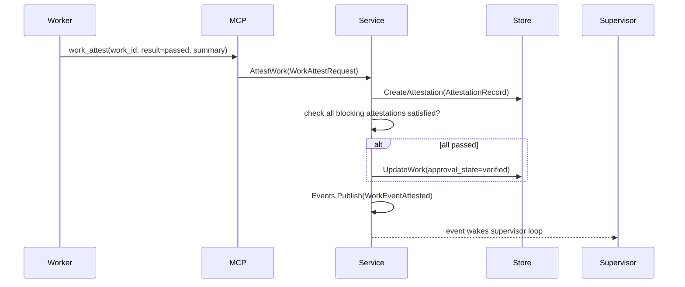
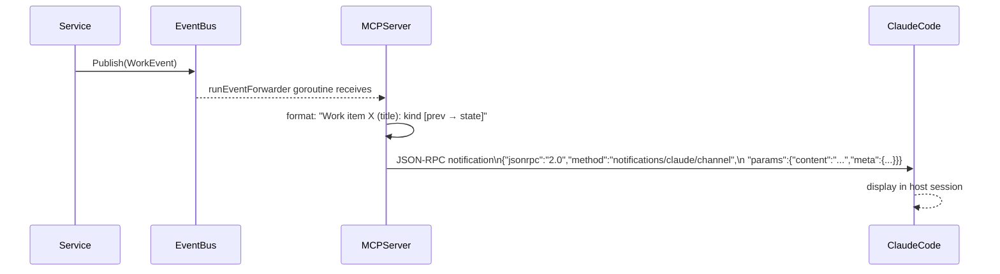
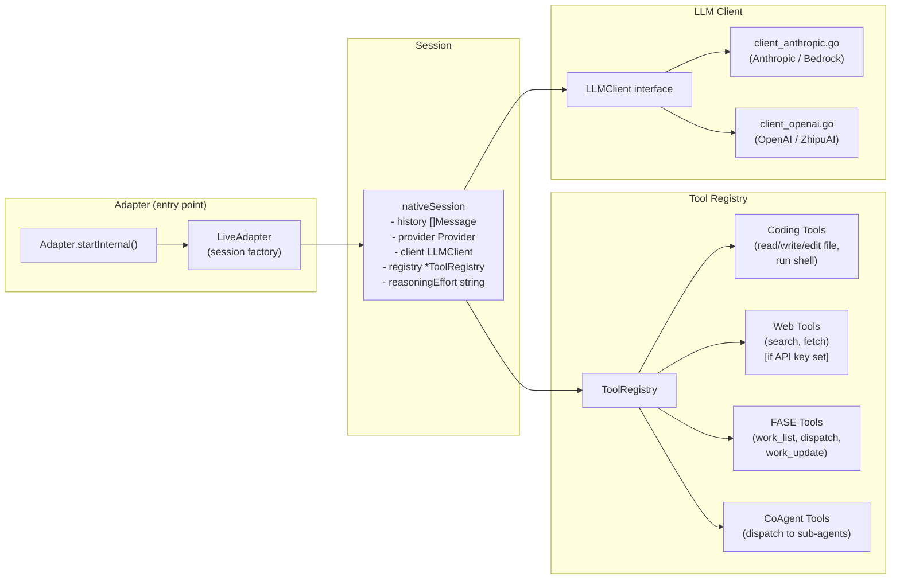
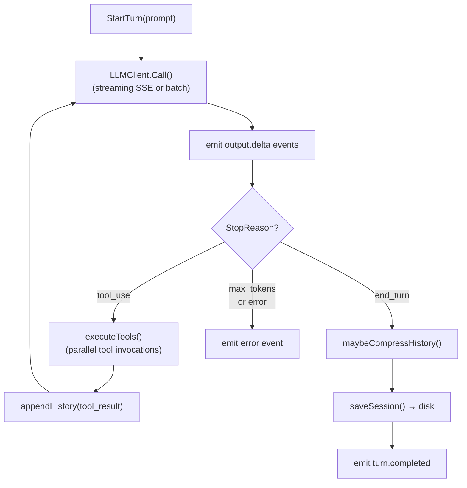
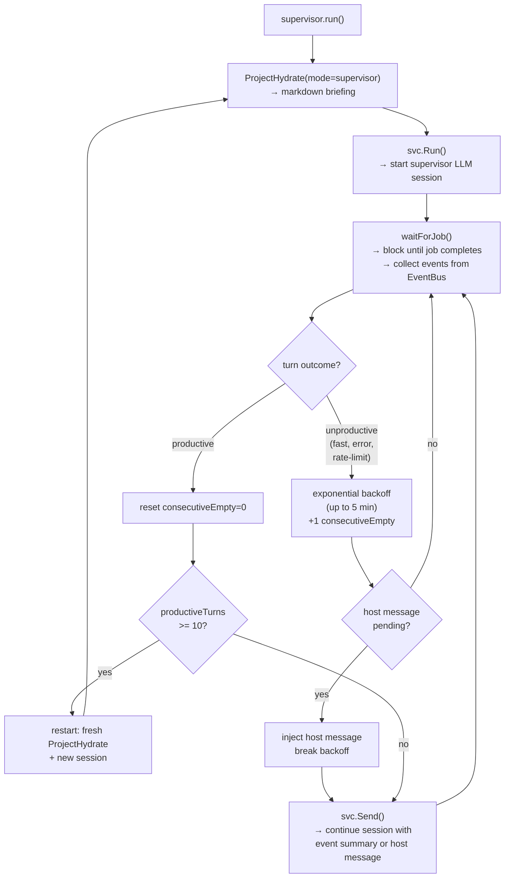
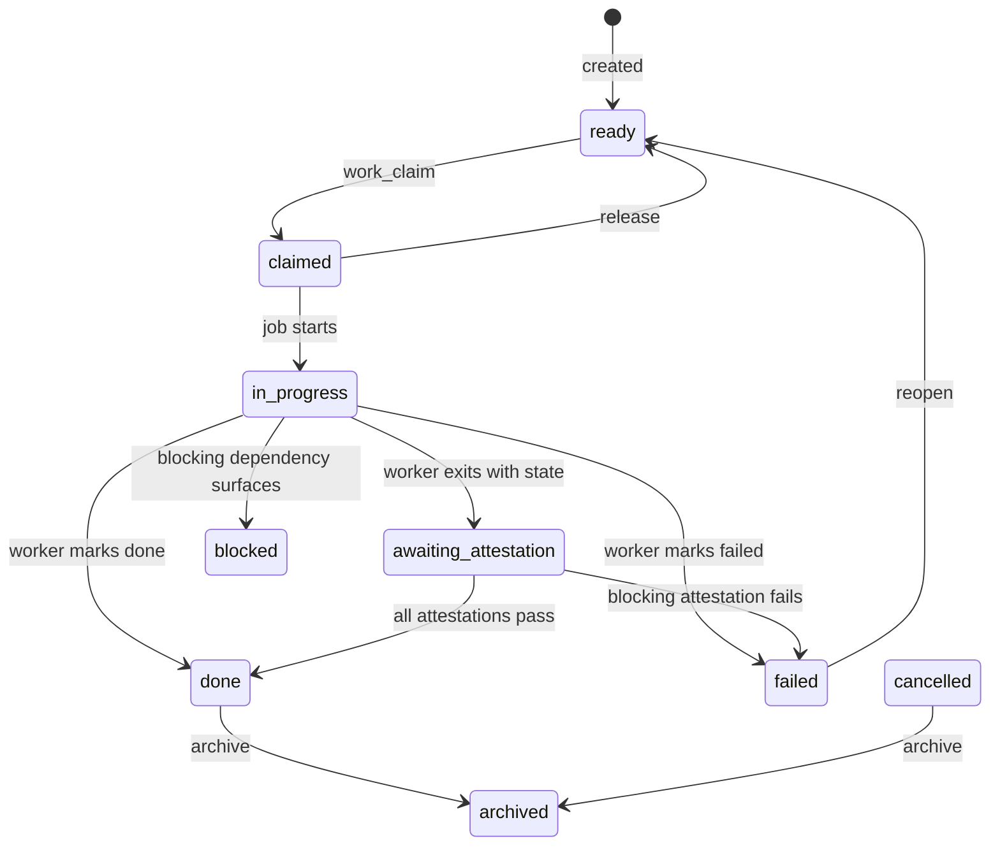
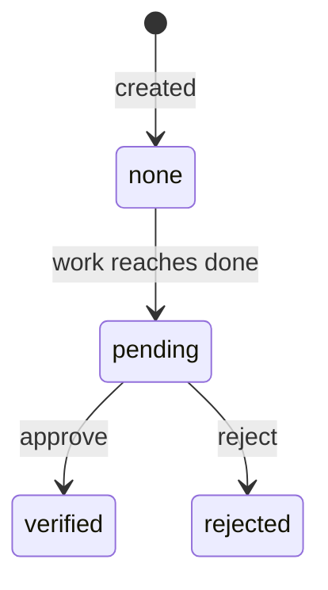
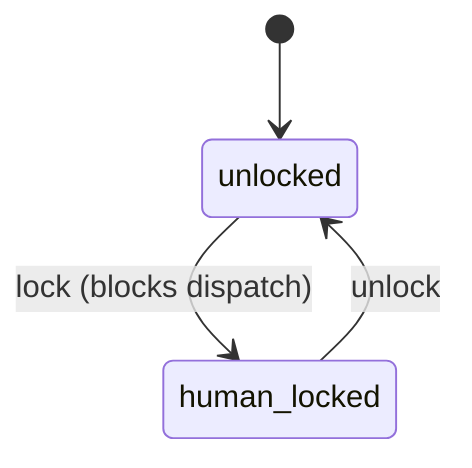

# FASE System Architecture

> Generated from source: 2026-03-23. Read actual code in `internal/` for authoritative details.

## Overview

FASE is a **local work control plane** for governed agent software engineering. Its core invariant: agents may always stop, the system may always resume. Work is not "done" because an agent says so — it is done when durable evidence satisfies the attestation policy.

The architecture is organized around five concerns:

1. **Work graph** — SQLite-backed DAG of work items, edges, attestations, and approvals
2. **Service layer** — orchestrates job lifecycle, hydration, and event publication
3. **Adapter layer** — translates service requests into LLM interactions (subprocess or in-process)
4. **MCP server** — exposes work graph tools to Claude Code over stdio; forwards events as channel notifications
5. **Supervisor agent** — LLM session that continuously discovers, claims, and delegates ready work

---

## Component Diagram



---

## Package Structure

```
cmd/fase/          Entry point → cli.Execute()
internal/
  adapterapi/      Adapter interface contract (Adapter, LiveAgentAdapter, LiveSession)
  adapters/
    native/        In-process adapter: LLM client, session state, tool registry, run loop
    claude/        Subprocess wrapper: invokes claude CLI binary
    codex/         Subprocess wrapper: invokes codex CLI binary
    opencode/      Subprocess wrapper + LiveAgentAdapter for OpenCode
    pi/            Subprocess wrapper + LiveAgentAdapter for Pi
    factory/       Subprocess wrapper: invokes factory CLI binary
    gemini/        Subprocess wrapper: invokes gemini CLI binary
    registry.go    Adapter registry (name → Adapter)
  catalog/         Model discovery, pricing metadata
  cli/             Cobra command tree, supervisor agent loop
  core/            Shared types: Job, Session, WorkItem, Attestation, WorkEdge
  debrief/         Session handoff/debrief rendering
  mcpserver/       MCP server (tools + channel notification forwarder)
  notify/          Notification system (email via Resend)
  pricing/         Token cost calculation
  service/         Core service: orchestration, hydration, work lifecycle, event bus
  store/           SQLite persistence (modernc.org/sqlite, pure Go)
  transfer/        Session transfer and export
  web/             Embedded web UI (mind-graph visualization)
```

---

## Data Flow

### Starting a Work Item



### Attestation Flow



### MCP Channel Notification Path



---

## MCP Server

**File**: `internal/mcpserver/server.go`

The MCP server bridges the Claude Code host and the FASE work graph. It runs as a stdio subprocess started by `fase mcp`.

### Architecture

```
Claude Code Host
      │
      │  stdin/stdout (JSON-RPC 2.0 / MCP protocol)
      │
  ┌───▼──────────────────────────────┐
  │  MCP Server (mcpserver.Server)   │
  │                                  │
  │  ┌─────────────────────────┐     │
  │  │  Tool Handlers          │     │
  │  │  - project_hydrate      │     │
  │  │  - work_list            │     │
  │  │  - work_show            │     │
  │  │  - work_create          │     │
  │  │  - work_update          │     │
  │  │  - work_claim           │     │
  │  │  - work_attest          │     │
  │  │  - work_note_add        │     │
  │  │  - work_notes           │     │
  │  │  - ready_work           │     │
  │  │  - notify_host          │     │
  │  └──────────┬──────────────┘     │
  │             │                    │
  │  ┌──────────▼──────────────┐     │
  │  │  Service (work graph)   │     │
  │  └─────────────────────────┘     │
  │                                  │
  │  ┌─────────────────────────┐     │
  │  │  EventForwarder gorout. │─────┼──► channel notifications
  │  │  (EventBus subscriber)  │     │    (notifications/claude/channel)
  │  └─────────────────────────┘     │
  └──────────────────────────────────┘
```

### Channel Notification Protocol

The MCP server declares `"claude/channel": {}` in its experimental capabilities. When a work event fires, `runEventForwarder` converts it to a JSON-RPC notification sent over the same stdio pipe:

```json
{
  "jsonrpc": "2.0",
  "method": "notifications/claude/channel",
  "params": {
    "content": "Work item work_01ABC (My task): work_updated [in_progress → awaiting_attestation]",
    "meta": {
      "work_id": "work_01ABC",
      "kind": "work_updated",
      "state": "awaiting_attestation",
      "prev_state": "in_progress"
    }
  }
}
```

A `sync.Mutex` (`Server.mu`) serializes writes so channel notifications never interleave with MCP protocol frames.

The `notify_host` tool (registered via `registerChannelTools`) lets the supervisor or any worker push an arbitrary message back to the Claude Code host session.

---

## Native Adapter

The native adapter runs LLM interactions in-process rather than spawning an external CLI binary. It is the only adapter with full tool support, history persistence, and context management.

### Internal Structure



### Run Loop (`loop.go: runToolLoop`)



### Session Persistence

After each completed turn, `nativeSession` serializes its message history to `.fase/native-sessions/<id>.json`. On `ContinueRun`, this history is loaded from disk and injected before the new prompt. This enables resumable sessions across process boundaries.

### History Compression (`history_compress.go`)

After each turn, `maybeCompressHistory` checks if the serialized history exceeds a threshold. If so, it asks the LLM to summarize older turns and replaces them with a condensed summary message. This prevents context window overflow proactively.

### CoAgent Support (`tools_coagent.go`)

The native adapter registers co-agent tools that let one LLM session delegate work to a sub-agent (codex, opencode, pi, or another native session). The `coAgentManager` maintains a registry of `LiveAgentAdapter` instances and routes tool calls to them.

### Provider & Auth (`provider.go`, `auth.go`)

Model strings use `provider/model` format (e.g. `bedrock/claude-sonnet-4-6`, `zai/glm-5-turbo`). `ParseProviderModel` resolves the provider enum and selects the correct LLM client implementation. Auth is resolved from environment variables or `~/.config/fase/auth.toml`.

---

## Supervisor Agent

**File**: `internal/cli/supervisor_agent.go`

The supervisor is an LLM agent (not scripted logic) that continuously manages the work queue. It runs as a long-lived adapter session with access to FASE MCP tools.

### Architecture



### Key Behaviors

| Behavior | Detail |
|---|---|
| **Cold start** | `ProjectHydrate(mode="supervisor")` renders full project briefing as the first prompt |
| **Event wakeup** | `EventBus.Subscribe()` — supervisor receives all work events; filters via `RequiresSupervisorAttention()` |
| **Backoff** | Consecutive unproductive turns trigger exponential backoff capped at 5 minutes |
| **Context rotation** | After 10 productive turns, session restarts with a fresh hydration to prevent context overflow |
| **Host messages** | `hostCh` channel delivers operator-injected prompts; breaks backoff immediately |
| **Default adapter** | `claude` (Claude Code subprocess), model `claude-sonnet-4-6` |
| **Supervisor tools** | Full FASE MCP tool set (work_list, work_claim, work_attest, work_create, etc.) |

The supervisor LLM is responsible for all dispatch and attestation logic. The Go code only manages session lifecycle, backoff, and context rotation. No scripted dispatch heuristics exist in Go.

---

## Work Item State Machine

### Execution States



### Approval States



### Lock States



---

## Work Graph Edges

| Edge Type | Blocking | Direction | Semantics |
|---|---|---|---|
| `parent_of` | No | parent → child | Hierarchy / scoping |
| `blocks` | Yes | blocker → blocked | Hard prerequisite |
| `verifies` | No | verifier → subject | Attestation relationship |
| `discovered_from` | No | source → discovery | Lineage tracking |
| `supersedes` | Soft | new → old | Replacement on retry |
| `relates_to` | No | bidirectional | Informational link |

---

## Event Bus

**File**: `internal/service/events.go`

The `EventBus` is an in-process pub/sub bus. Publishers call `Publish(WorkEvent)` synchronously; delivery to each subscriber channel is non-blocking (drops if the buffer is full).

### Event Types

| Kind | Cause examples | Wakes supervisor? |
|---|---|---|
| `work_created` | `work_created` | Yes |
| `work_updated` | `worker_terminal`, `worker_progress`, `host_manual` | Yes (unless actor = supervisor) |
| `work_claimed` | `claim_changed` | Yes |
| `work_released` | `claim_changed` | Yes |
| `work_attested` | `attestation_recorded` | Yes |
| `work_lease_renewed` | `lease_reconcile` | No |
| any | `housekeeping_stall`, `housekeeping_orphan` | Yes |
| any | actor = `housekeeping` or `reconciler` | No |

### Subscribers

- **MCP Server** (`runEventForwarder`): forwards all events as Claude channel notifications
- **Supervisor** (`agenticSupervisor.run`): filters via `RequiresSupervisorAttention()`, uses to decide next turn timing

---

## SQLite Store

**File**: `internal/store/store.go`

Single SQLite file at `.fase/fase.db` (pure Go via `modernc.org/sqlite`).

### Core Tables

| Table | Purpose |
|---|---|
| `sessions` | Conversation sessions (adapter, tags, metadata) |
| `jobs` | Execution jobs (state machine, work_id, summary, cost) |
| `turns` | Individual conversation turns |
| `native_sessions` | Native adapter conversation history (JSON) |
| `artifacts` | Job outputs (stdout, code, documents) |
| `events` | Audit log of all work events |
| `work_items` | Work graph nodes (objective, state machines, metadata) |
| `work_edges` | Graph edges (type, source, target) |
| `work_updates` | State transition log (message, job ref, creator) |
| `work_notes` | Notes (finding / convention / private) |
| `work_proposals` | Structural change proposals |
| `attestation_records` | Verification results (blocking, method, confidence) |
| `approval_records` | Human approval decisions (commit OID) |
| `promotion_records` | Promotion records (commit OID, environment) |
| `doc_content` | Markdown doc projections |
| `locks` | Distributed lease locks |
| `catalog_snapshots` | Model availability snapshots |

### Design Notes

- Transactions for multi-step operations (`CreateSessionAndJob`, etc.)
- JSON columns for extensible metadata (PostgreSQL-style)
- Soft deletes via `execution_state = "archived"` — no hard deletes
- `strftime('%Y-%m-%dT%H:%M:%SZ', 'now')` for RFC3339 timestamps (critical: space-separated format causes parse errors)

---

## Hydration System

### Worker Briefing (`CompileWorkerBriefing`)

Generates a deterministic JSON briefing for a specific work item. Any agent receiving this briefing can pick up where any other left off.

Sections:
- **runtime**: config path, state dir, claimant info
- **assignment**: work_id, title, objective, kind, state, priority
- **requirements**: acceptance criteria, model traits, adapter preferences
- **context**: parent, blocking edges (inbound/outbound), child items, related attestations
- **state**: recent updates, notes, attestations, jobs, artifacts
- **guidance**: open questions, next actions, contract rules

### Project Briefing (`ProjectHydrate`)

Generates a project-scoped briefing used by the supervisor and Claude Code host.

Hydration modes:
| Mode | Convention limit | Item limit | Use case |
|---|---|---|---|
| `thin` | 20 | 5 | Quick context refresh |
| `standard` | 50 | 10 | Default |
| `deep` | 200 | 15 | Deep research/planning |
| `supervisor` | all | all | Supervisor cold start |

---

## Adapter Interface

**File**: `internal/adapterapi/types.go`, `internal/adapterapi/live.go`

All adapters implement `adapterapi.Adapter`:

```go
type Adapter interface {
    Name() string
    Capabilities() Capabilities
    Implemented() bool
    Binary() string
    Detect(ctx context.Context) (Diagnosis, error)
    StartRun(ctx context.Context, req StartRunRequest) (*RunHandle, error)
    ContinueRun(ctx context.Context, req ContinueRunRequest) (*RunHandle, error)
}
```

`StartRun` and `ContinueRun` return a `RunHandle` with `Stdout`/`Stderr` io pipes. The service reads JSONL events from `Stdout` and persists them as job artifacts.

Live adapters (native, codex, opencode, pi) additionally implement `adapterapi.LiveAgentAdapter`:

```go
type LiveAgentAdapter interface {
    Name() string
    StartSession(ctx, req) (LiveSession, error)
    ResumeSession(ctx, nativeSessionID string, req) (LiveSession, error)
}
```

`LiveSession` supports `StartTurn`, `Steer` (mid-turn injection), `Interrupt`, and an `Events()` channel of typed `adapterapi.Event` values.

### Adapter Comparison

| Adapter | Type | HeadlessRun | NativeFork | StructuredOutput | Tool Support |
|---|---|---|---|---|---|
| `native` | in-process | ✓ | ✓ | ✓ | Full (coding + web + FASE + coagent) |
| `claude` | subprocess | ✓ | — | — | Via Claude Code's built-in tools |
| `codex` | subprocess | ✓ | — | — | Via Codex built-in tools |
| `opencode` | subprocess | ✓ | — | — | Via OpenCode built-in tools |
| `pi` | subprocess | ✓ | — | — | Via Pi built-in tools |
| `factory` | subprocess | ✓ | — | — | Via Factory built-in tools |
| `gemini` | subprocess | ✓ | — | — | Via Gemini built-in tools |

External (subprocess) adapters communicate through stdin/stdout and have no direct access to the FASE work graph during execution. They receive a compiled briefing as their initial prompt and must call `fase work update` via shell to record progress.

---

## Key Invariants

1. **Attestation is mandatory.** Work is not done until all `required_attestations` with `blocking=true` are satisfied by an independent agent.
2. **One code-writer per environment.** Multiple readers (plan/attest/research) may run concurrently; only one writer at a time to prevent concurrent edit corruption.
3. **Workers must git commit before exiting.** The briefing contract requires a commit before updating execution state.
4. **State belongs in the work graph, not prompts.** Conventions, findings, and decisions are stored as work notes so any future agent can reconstruct context.
5. **The DAG does not advance past a node until its attestations are satisfied.** Approval state is only set to `verified` after all blocking attestations pass.
